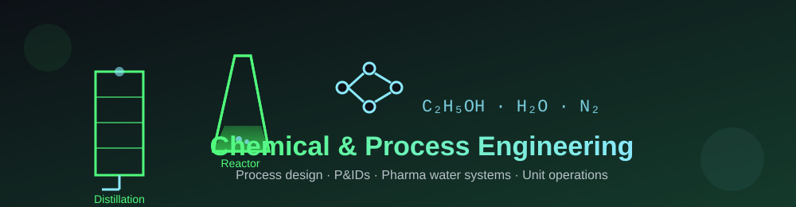

  

  

  
  
  
  
  
  

---

<h2 align="center">🧪 About Me</h2>

  I'm a <b>Chemical &amp; Process Engineer</b> who fell in love with <b>software</b>.
  Trained as a full-stack <b>Software Engineer at ALX</b>, I now work as a
  <b>Production Officer at QCIL</b> — East Africa's largest pharmaceutical company —
  where I blend lab thinking with clean code. 💊⚙️

  
  
  
  
  

  

<h2 align="center">⚡ Quick Facts</h2>

- 🔭 I'm currently working on **SecondChance** — a REST API that gives household items a second life.
- 🌱 I'm deepening my skills in **Node.js, Express, MongoDB** and **Python**.
- 💬 Ask me about **process engineering, pharma water systems (PW / WFI), P&amp;IDs, or building APIs**.
- 🎯 Goal: bridge **chemical engineering** and **software engineering**.
- ⚡ Fun fact: I treat pipelines like processes — unit by unit. 🧩

---

<h2 align="center">🚀 Featured Projects</h2>

  
  
  

| Project | What it does | Stack |
| --- | --- | --- |
| [💊 drug_recommendation](https://github.com/MarkNwilliam/drug_recommendation) | ML drug recommendation for pharmaceutical use cases | Python |
| [⚡ biogas-solar-systems-design](https://github.com/MarkNwilliam/biogas-solar-systems-design) | Design &amp; plan biogas and solar energy systems (desktop app) | Python |
| [🗣️ uganda-dysarthric-asr](https://github.com/MarkNwilliam/uganda-dysarthric-asr) | First-ever Luganda &amp; Ugandan-English **dysarthric ASR** models | Python |
| [📚 tutorcraft](https://github.com/MarkNwilliam/tutorcraft) | AI video-tutorial generator — Khan-Academy style, any topic | Python |
| [🗞️ cuppaai](https://github.com/MarkNwilliam/cuppaai) | Make voice/video ads with an AI agent + post-time analysis | JavaScript |
| [🖥️ cars-dealership-capstone](https://github.com/MarkNwilliam/cars-dealership-capstone) | IBM Full Stack Developer Capstone — Best Cars Dealership | JavaScript |
| [💠 secondchance-backend](https://github.com/MarkNwilliam/secondchance-backend) | REST API: give away &amp; recycle household items (Node/Express/MongoDB) | JavaScript |
| [📱 mobile-shop-app](https://github.com/MarkNwilliam/mobile-shop-app) | ShopEasy — React Native shopping app (Expo + DummyJSON) | JavaScript |
| [⚗️ chemical-reactor-pid](https://github.com/MarkNwilliam/chemical-reactor-pid) | Animated CSTR P&amp;ID + reactor design calcs + interactive simulation | Python · SVG |

  <b>More:</b>
  <a href="https://github.com/MarkNwilliam/datachat">datachat</a> ·
  <a href="https://github.com/MarkNwilliam/textmermaid">textmermaid</a> ·
  <a href="https://github.com/MarkNwilliam/ai-farmer-streamlit">ai-farmer-streamlit</a> ·
  <a href="https://github.com/MarkNwilliam/researchvidfull">researchvidfull</a> ·
  <a href="https://github.com/MarkNwilliam/med_appt">med_appt</a> ·
  <a href="https://github.com/MarkNwilliam/pharmacareapplication">pharmacareapplication</a> ·
  <a href="https://github.com/MarkNwilliam/alx-files_manager">alx-files_manager</a> ·
  <a href="https://github.com/MarkNwilliam/Semilog">Semilog</a>

---

<h2 align="center">🏭 Process Engineering — P&amp;ID Designs</h2>

  As a chemical engineer I design pharmaceutical water systems. Here are the
  P&amp;IDs I prepared for a pharma facility — <b>Purified Water</b> and
  <b>Water for Injection</b>.

<h3 align="center">💧 Purified Water (PW) System</h3>

  
   
  

<h3 align="center">🧊 Water for Injection (WFI) System</h3>

  
   
  

<h3 align="center">⚗️ Jacketed CSTR — Reactor P&amp;ID &amp; Design</h3>

  
   
  
   
  

---

<h2 align="center">🎓 Certifications</h2>

  

  
  
  
  
  

  
  
  

---

<h2 align="center">🛠️ Tech Stack</h2>

  

<h2 align="center">📊 GitHub Analytics</h2>

  
  

  

<h2 align="center">🐍 Watch the Snake Eat My Commits</h2>

  

---

<h2 align="center">🤝 Let's Connect</h2>

  
  
  
  

  

  <i>⚗️ Mix. Measure. Ship. — processes &amp; code.</i>

